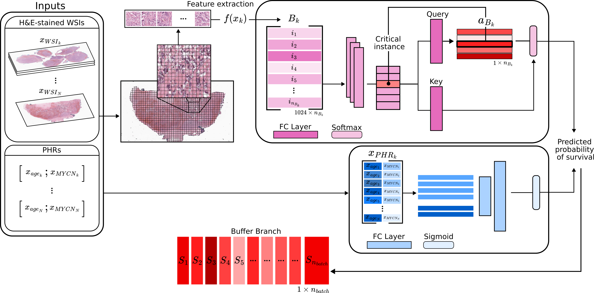

# SurvivMIL: A Multimodal, Multiple Instance Learning Pipeline for Survival Outcome of Neuroblastoma Patients 

A pytorch lightning implementation of a multimodal, multiple instance learning model described in the paper [SurvivMIL: A multimodal, Multiple Instance Learning pipeline for Survival Outcome of Neuroblastoma Patients](https://openreview.net/pdf?id=7o2RyN0wNf) (MICCAI COMPAYL 2024, Accepted).



## Acknowledgement

This repository is built largely upon the works of [DSMIL](https://github.com/binli123/dsmil-wsi?tab=readme-ov-file)


## Citation

```
@inproceedings{
naidoo2024survivmil,
title={Surviv{MIL}: A Multimodal, Multiple Instance Learning Pipeline for Survival Outcome of Neuroblastoma Patients},
author={Reed Naidoo and Olga Fourkioti and Matt De Vries and Chris Bakal},
booktitle={MICCAI Workshop on Computational Pathology with Multimodal Data (COMPAYL)},
year={2024},
url={https://openreview.net/forum?id=7o2RyN0wNf}
}
```


